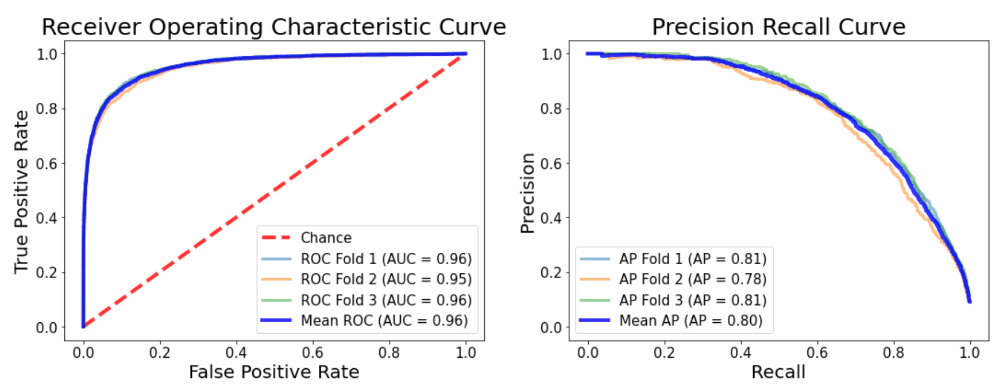

# Melanoma Detection Using EffNet Transfer Learning 

Author: TeYang, Lau  
Last Updated: 19 August 2020

### **Please refer to this [notebook](https://www.kaggle.com/teyang/melanoma-detection-using-effnet-and-meta-data) on Kaggle for a more detailed description, analysis and insights of the project.** 

## **Project Motivation** 

For this project, I applied deep learning and convolutional neural networks onto health data, which is my interest and linked to my background and work experience in psychology and neuroscience. Machine learning will becoming increasingly important in healthcare, and can help with the diagnosis and prediction of many diseases if used correctly. Here, I also tried using **TPUs** to train the model using **Tensorflow** and **Keras** as the deep learning framework as TPUs are really efficient at crunching large datasets in a short time.

This project is also a competition on **Kaggle**, and I wanted to give it a try, as there is often a better and greater community in the competition compared to other datasets. This provided the opportunity to learn from others who are more experienced data scientists and computer vision experts.

## **Project Goals** 

1. To build a deep learning model to **detect** melanoma from images of skin lesions
2. Use state-of-the-art **TPUs** to train the model
3.  Learn different strategies for improving model performance (e.g., learning rate scheduling, label smoothing, test time augmentation)

## **Project Overview** 

* Configure and initialize **TPU**
* Feeding **tensorflow records** (TFrecords) to TPU for training and testing
* **Learning rate scheduling** to improve model training time
* **Data augmentation** to create diversity and for **Test Time Augmentation** (TTA)
* Using `EffNets` to pre-train model on Kaggle's TPU
* Performing **K-fold Cross Validation** for evaluating model performance
* Building **ensemble models** by merging predictions from image-trained and metadata-trained models

## **About this Dataset** 

The [skin lesions images](https://www.kaggle.com/c/siim-isic-melanoma-classification/overview) were provided courtesy of the [International Skin Imaging Collaboration (ISIC)](https://www.isic-archive.com/#!/topWithHeader/wideContentTop/main). The ISIC Archive was created, which hosts an international repository of dermoscopic images, for both the purposes of clinical training, and for supporting technical research toward automated algorithmic analysis. It contains the largest publicly available collection of quality-controlled dermoscopic images of skin lesions. This competition was held in collaboration with the [Society for Imaging Informatics in Medicine (SIIM)](https://siim.org/). Images in TFRecord format have been resized to a uniform 1024x1024, and metadata were also provided. This year's data (2020) consists of ~33,000 train images and ~10,000 test images. There is also a data class imbalance, with more malignant compared to benign skin lesion images. 

 

## Skin Lesion Samples

Here are some sample pictures of the skin lesion images and their associated diagnosis. 

## **Data Augmentation** 

I performed data augmentation by transforming the pictures (random rotation, flipping, random brightness and contrast, horizontal and vertical shifting, etc) to produce more diversity in the dataset. 

## **Model Architecture** 

I made use of the power of transfer learning to pretrain the model. As these were already pre-trained, we can use the first layers of weights and add a few additional layers to classify the images into 2 categories. For this project, I used the state-of-the-art Efficient Net model **EffNet B2,B4,B6**. It uniformly scales the 3 dimensions of a CNN: **Depth**, **Width**, and **Resolution** using a **compound coefficient ɸ **. ɸ is a user-specified coefficient, which produces **EfficientNets** ***B1-B7***.

## **Model Training Performance** 

The model was trained using K-fold cross validation. **Test time augmentation (TTA)** was applied to the validation set to reduce errors in predictions, which improves its performance. Training and validation performance of one fold is shown in the figure below.

In addition to **area under operating characteristic (AUROC)** score, which is the competition's evaluation metric, I also looked at the **Precision Recall Curve (PRC)** to get a better idea of the model's performance. The PRC showed that there can still be lots of improvement to our model, while the AUROC showed an over-optimistic good performance.

## **Model Test Performance** 

The model achieved an **AUROC score of 0.95** on the public leaderboard test set (30%) and an **AUROC score of 0.93** on the private leaderboard (70%). 

## **Difficulties Faced** 

* **Data class imbalance:** This is quite prevalent in the real world and as data scientists, we should all learn to embrace it and find ways to get around this problem. Usually, one way is to simply collect more data for the undersampled class. However, this is not possible for this dataset and especially for healthcare data, which is very difficult to collect and share. In reality, malignant cases will also be less prevalent than benign cases. In this notebook, I used stratified sampling to get around this problem but this does not totally solve the issue. One other way might be to apply weighted loss to give more weights to the loss of the malignant images. However, I tried it and it seems to hinder performance for this dataset.
* **Overfitting:** This dataset is prone to overfitting, especially if one uses a quickly increasing learning rate. Therefore, I only ran the model for ~ 10 epochs as it starts to overtrain by then.

## **Conclusions** 

In conclusion, our model performs reasonably well based on AUROC score but there can still be room for vast improvement according to the AUPRC score. In the diagnosis of melanoma (to classify lesions as malignant or benign), we often want our recall/sensitivity to be high since we want to correctly identify all true malignant cases. For our model, if we set a low threshold to get a high recall, our precision will greatly suffer, which means that during melanoma screening, many people will get false diagnosis of melanoma (high false positives). Therefore, the current model is still not great for deployment.

**What I learnt:**

* **Learning rate scheduling using ** [**One fit cycle:**](https://pytorch.org/docs/stable/_modules/torch/optim/lr_scheduler.html#OneCycleLR) The 1cycle policy anneals the learning rate from an initial learning rate to some maximum learning rate and then from that maximum learning rate to some minimum learning rate much lower than the initial learning rate. This policy was initially described in the paper [Super-Convergence: Very Fast Training of Neural Networks Using Large Learning Rates](https://arxiv.org/abs/1708.07120). Refer to this [post](https://sgugger.github.io/the-1cycle-policy.html) to get a better understanding.
* **EfficientNets:** Who would have thought that such a simple scaling of the 3 dimensions of a CNN can lead to such efficiency in model training!
* **Using TPUs:** TPUs are really efficient for training large neural networks and data compared to CPU and GPU. The future of deep learning and AI is becoming more impressive.   
* **Test Time Augmentation:** TTA provides a way to reduce the errors in the predictions and is a really useful technique. Combined with TPU, it provides the opportunity to train and evaluate models with a lot more diversity in the data.
* **Label Smoothing:** A useful regularization technique for preventing the model from predicting too confidently by modifying hard labels into soft labels, which reduces the gap between the largest logit and the rest.
* **K-fold Cross Validation in Neural Networks:** For my past deep learning projects, I have always trained using a separate train and validation sets. K-fold CV provide a more robust way to evaluate the performance of the model, and it has the advantage that every image is trained and evaluated.  
* **Using Ensemble models from different data:** Combining predictions trained from images using CNNs and metadata is a great way to improving the performance of the model.

